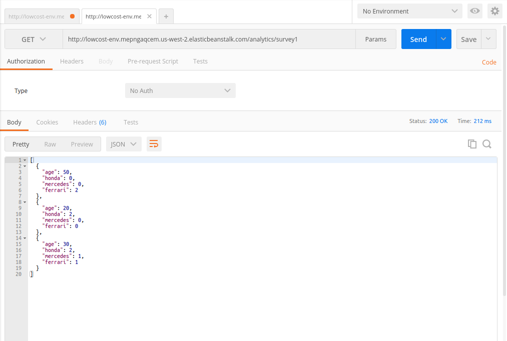

# cces

<Strong>Project Overview:</strong>
This is an online survey platform and utilize cloud computing resources on demand to compute and retrieve some knowledgeable insight out of the survey data received.The restful web services will store the received user input in a distributed storage platform backed by a cloud computing platform 

<ul>

<li>Survey Question -
Which is your favorite car ?
1) Honda
2) Mercedes
3) Ferrari

Amazon Applications-
Elastic Beanstalk
Dynamo DB

We did not use IAAS service which is EC2, because we had to configure lot many things like – installing TOMCAT. Hence we are using PAAS componenet which is EBS (Elastic Beanstalk) to host our application. 

Need of EBS
Through EBS we are deploying our application.
It easy to use, just have to mention the programming language that we want to use.
Provide the War or Jar file.

We have written a program and compiled it and it generated a war file. Here in the left side cces is a file which has been converted  in to cces.war and on the right side we have uploaded cces.war file in EBS.</li>

<li>There is a screen shot of our EBS configuration below where PORT is 8080, Scaling is single instance, Instances – t1.micro and we are using Spring Boot Framework to design our application.</li>

<li>This is how we can monitor our CPU </li>

<li>My data lives in Distributed cloud storage called Dynamo DB from AWS. There is a screen shot below shows the table ‘survey_data’.

In the table an email is a primary key and one unique email represents one unique row which has column, nationality, age and favCar (Favorite car). So this is our survey platform where people can submit their reviews, and what application does is on the run it distributively compute the result and shows the age and choise of the car for a particular country.
If 2 people like honda then the result will be 2 (total).</li>

<li>surveyController – Accepts the POST requests. AnalyticsController – Accept the analytic requests.AnalyticService – It is using Dynamo DB to compute and retrieve the data.SurveyService – Stores data into Dynamo DB.</li>

<li>To run a query on Dynamo DB we can select attributes that we have mentioned below, where we can see the American’s review by selecting the attribute.</li>

<li>We are using restful application so we do do not have any HTML view, hence we are using Postman to post a survey and to retrieve analytic data which has shown in the screen shot below-

This is a JSON structure showing post request where the people are filling a survey form by providing their email, age , nationality and favCar. </li>

<li>If a user wants to see the feedback he can see the responses through Postman GET responses which has been shown in the picture below.</li>

<li>The above link will show the survey result of an European (Also shown in the figure)-</li>

<li>This is how the result looks like-</li>

</ul>

